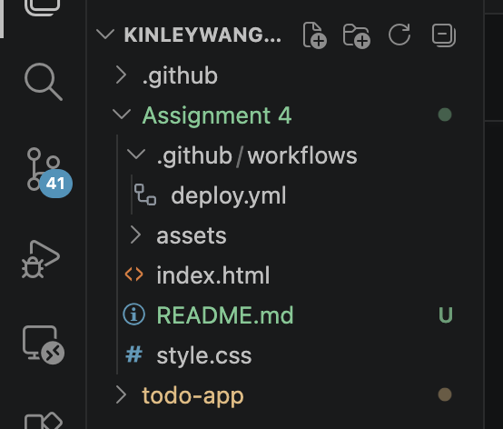
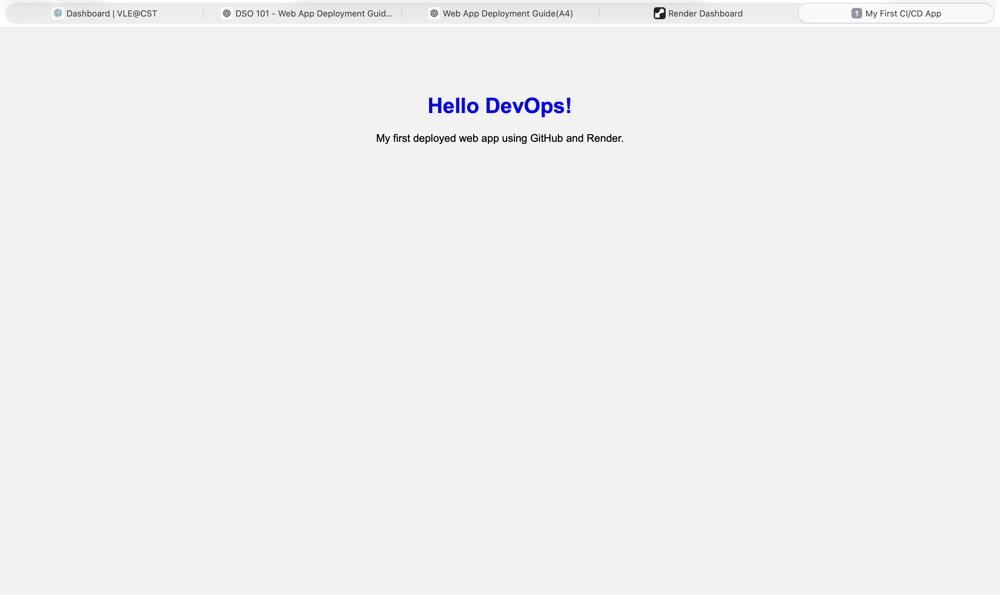
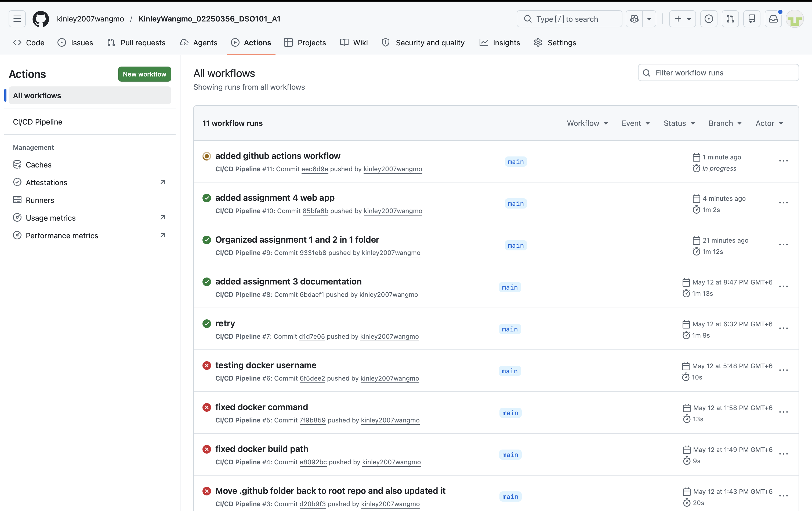
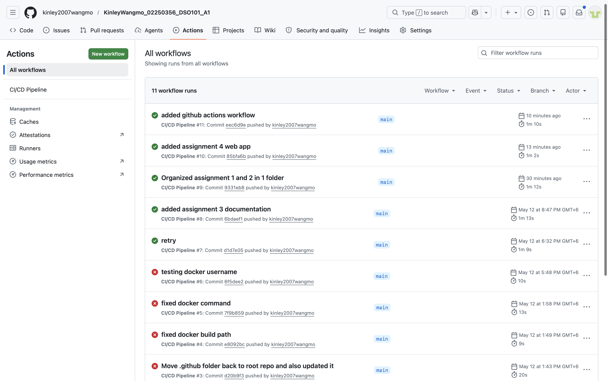
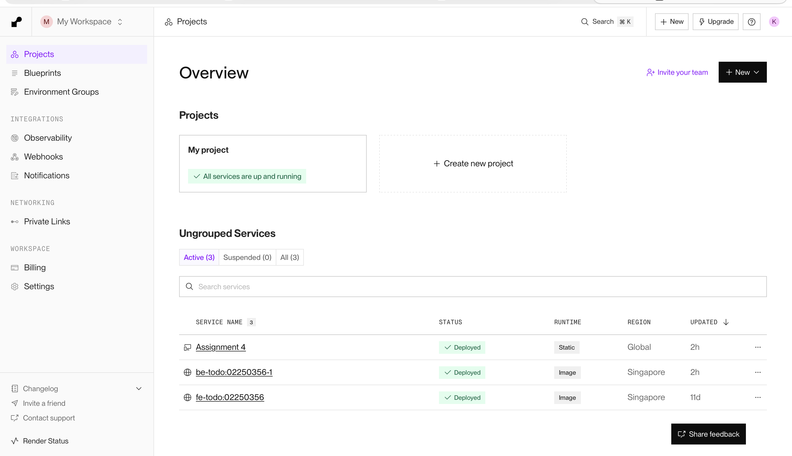
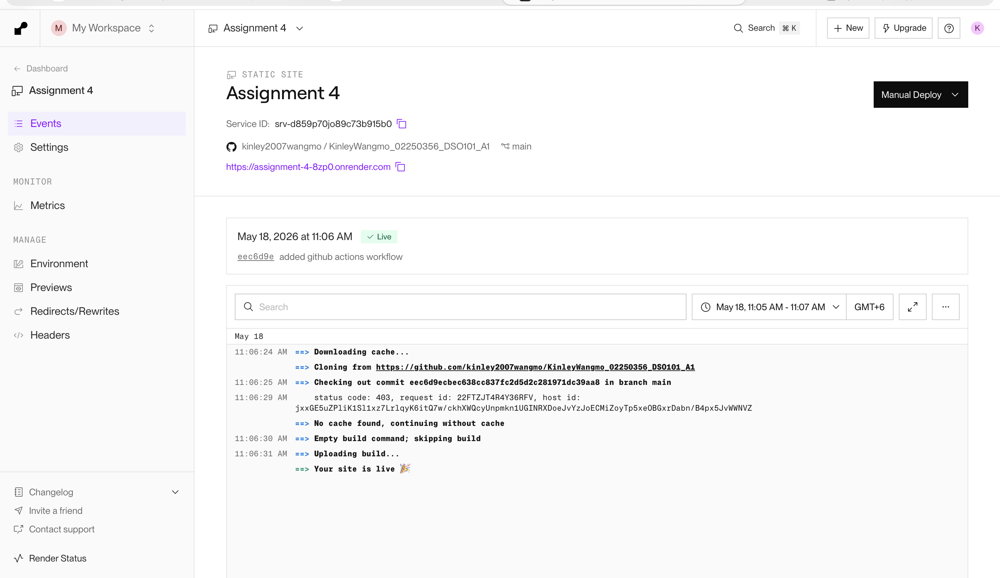

# DSO101 Assignment 4
## CI/CD Deployment (GitHub + GitHub Actions + Render)

## Objective
To build a simple static web application and deploy it using a CI/CD pipeline with GitHub Actions and Render.

## Project Overview
This project demonstrates a complete CI/CD workflow:
* Code is developed locally
* Pushed to GitHub repository
* GitHub Actions automatically runs workflow
* Render deploys the website automatically

## Tools Used
* HTML, CSS
* Git & GitHub
* GitHub Actions (CI/CD pipeline)
* Render (Hosting platform)
* VS Code

## Project Structure

## Steps Followed
1. Created Web App
* Built a simple static website using HTML and CSS.

2. Initialized GitHub Repository
* Created repository on GitHub
* Connected local project to GitHub
* Pushed initial code

3. Set Up GitHub Actions
* Created .github/workflows/deploy.yml
* Added CI/CD workflow file

4. CI/CD Pipeline
* Every push to main branch triggers workflow
* GitHub Actions runs automatically

5. Deployment on Render
* Connected GitHub repository to Render
* Selected Static Site
* Enabled auto-deployment

## Screenshots
* Local Website (Live Server)

* GitHub Actions Running

*  GitHub Actions Success

* Render Dashboard

* Live Website

## GitHub Repository Link
https://github.com/kinley2007wangmo/KinleyWangmo_02250356_DSO101_A1.git

## Live Website Link
https://assignment-4-8zp0.onrender.com

## Conclusion
This project successfully demonstrates a CI/CD pipeline using GitHub Actions and Render for automated deployment of a static web application.
