# DSO101 Assignment 1
## To-Do List Web Application

DSO101 – Continuous Integration and Continuous Deployment  
Student Name: Kinley Wangmo  
Student Number: 02250356  

### GitHub Repository
You can access the project source code using the link below:

https://github.com/kinley2007wangmo/KinleyWangmo_02250356_DSO101_A1.git

### Project Description
This project is a simple To-Do List web application that allows users to:
- Add tasks
- View tasks
- Delete tasks
- Manage their daily activities

### Technologies Used
Frontend:
- React
- JavaScript
- HTML
- CSS

Backend:
- Node.js
- Express

Database
- PostgreSQL

DevOps Tools
- Docker
- Docker Hub
- Render
- GitHub

### Project Structure
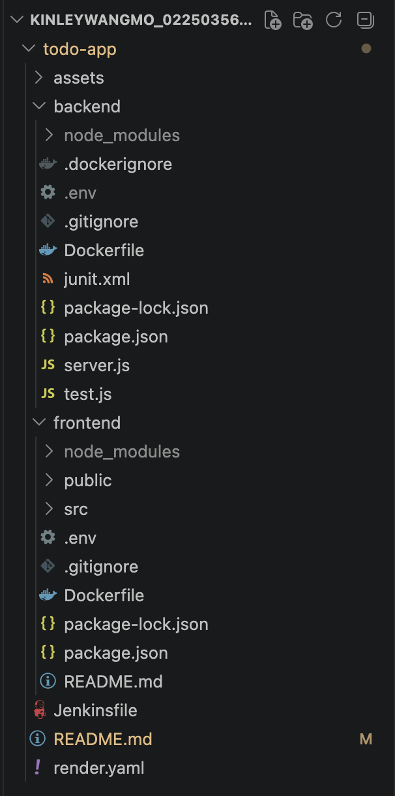

## Environment Variables

### Backend
```env
PORT=5000
DB_HOST=localhost
DB_USER=postgres
DB_PASSWORD=password
```

### Frontend
```env
REACT_APP_API_URL=https://be-todo.onrender.com
```

---

## Docker Setup

### Backend Docker Build

```bash
docker build -t kinley2007wangmo/be-todo:02250356 .
```

### Backend Docker Push

```bash
docker push kinley2007wangmo/be-todo:02250356
```

### Frontend Docker Build

```bash
docker build -t kinley2007wangmo/fe-todo:02250356 .
```

### Frontend Docker Push

```bash
docker push kinley2007wangmo/fe-todo:02250356
```

---

## Deployment on Render

### Backend Deployment
- Created Web Service using existing Docker image
- Configured environment variables
- Exposed port 5000

### Frontend Deployment
- Created Web Service using frontend Docker image
- Configured API URL environment variable

---

## Automated Deployment

A `render.yaml` file was configured for multi-service deployment.

```yaml
services:
  - type: web
    name: be-todo
    env: docker
    dockerfilePath: ./backend/Dockerfile

  - type: web
    name: fe-todo
    env: docker
    dockerfilePath: ./frontend/Dockerfile
```

---

## Testing

The application was tested by:
- Running backend service
- Running frontend service
- Verifying frontend-backend communication
- Checking deployment status on Render

---

## Screenshots

### Docker Hub of Backend 
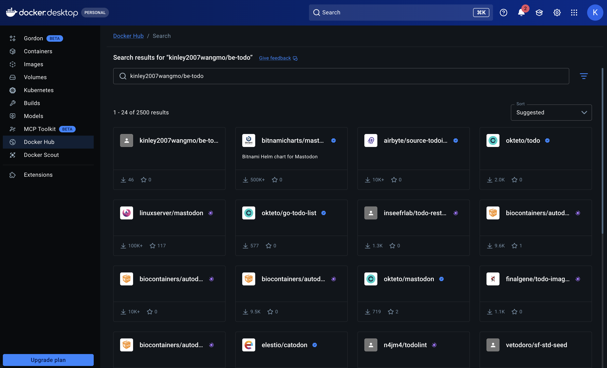

### Docker Hub of Frontend 
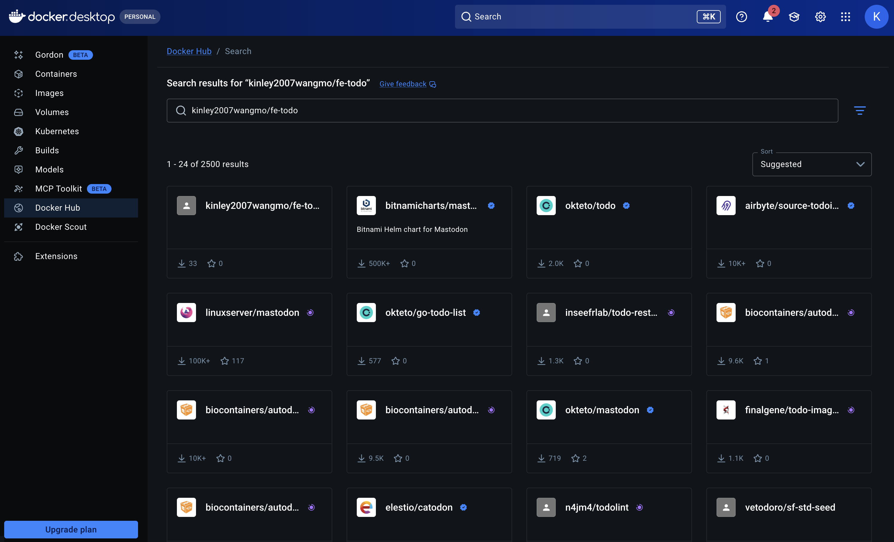

### Docker Images
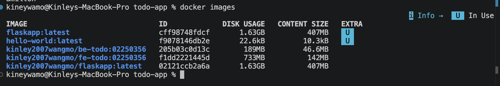

### Docker Hub Repository
(Add screenshot here)

### Backend Deployment
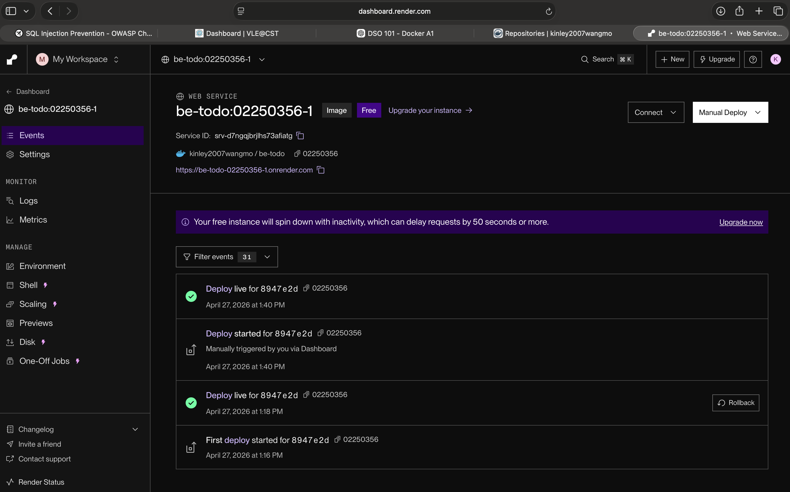

### Frontend Deployment
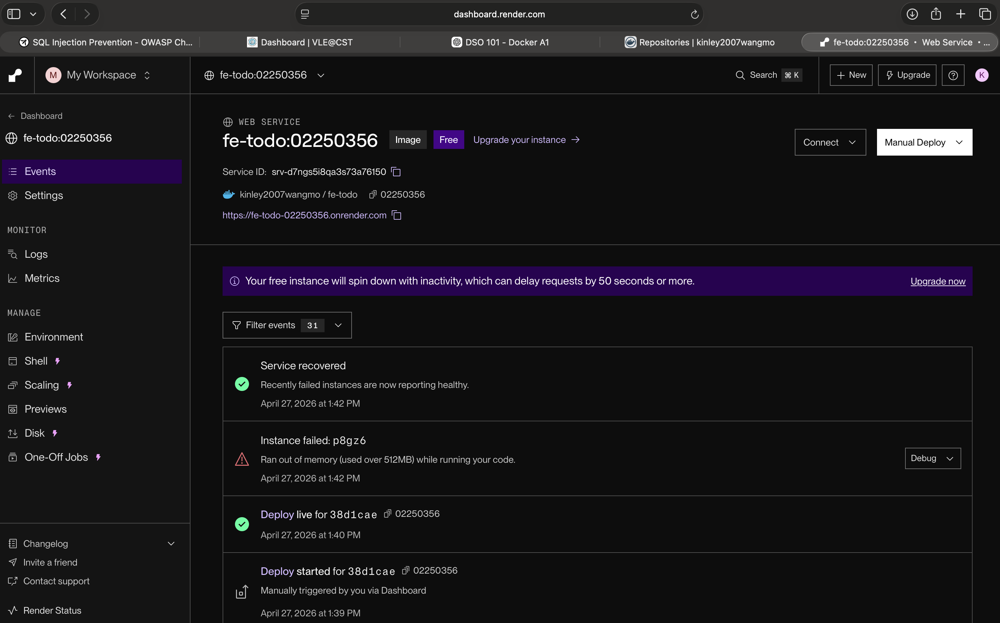

### Working Application
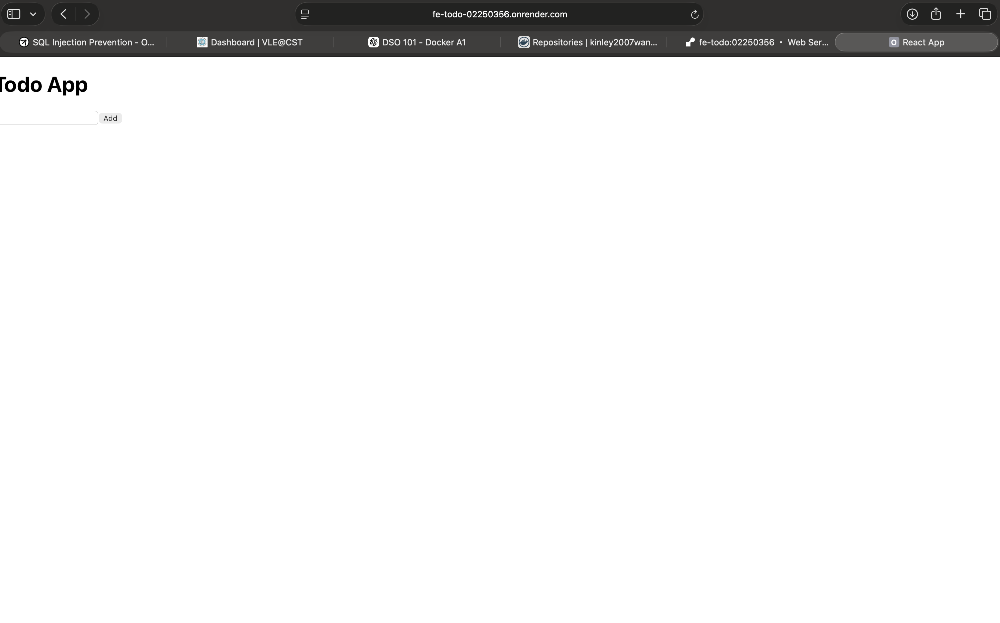

---

## References

- Docker Documentation
- Render Documentation
- GitHub Documentation

# DSO101 Assignment 2
## CI/CD Pipeline using Jenkins
This project now includes a Jenkins CI/CD pipeline for frontend + backend.

###  Project Overview
This project demonstrates CI/CD pipeline using Jenkins for a Node.js + React To-Do application.

---

### Tools and Technologies Used

- Jenkins
- GitHub
- Node.js
- npm
- React
- Jest
- VS Code

---

### Project Structure
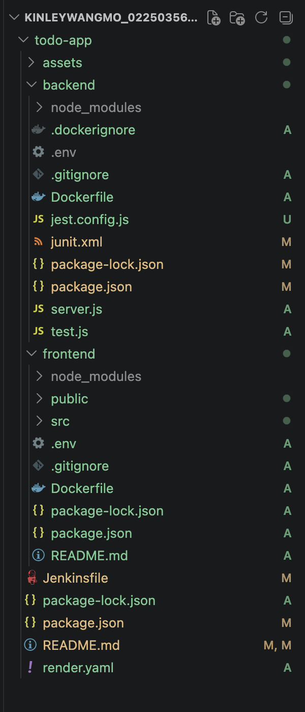

---

## Steps Performed

### 1. Jenkins Installation

Jenkins was installed and configured locally on localhost:8080.
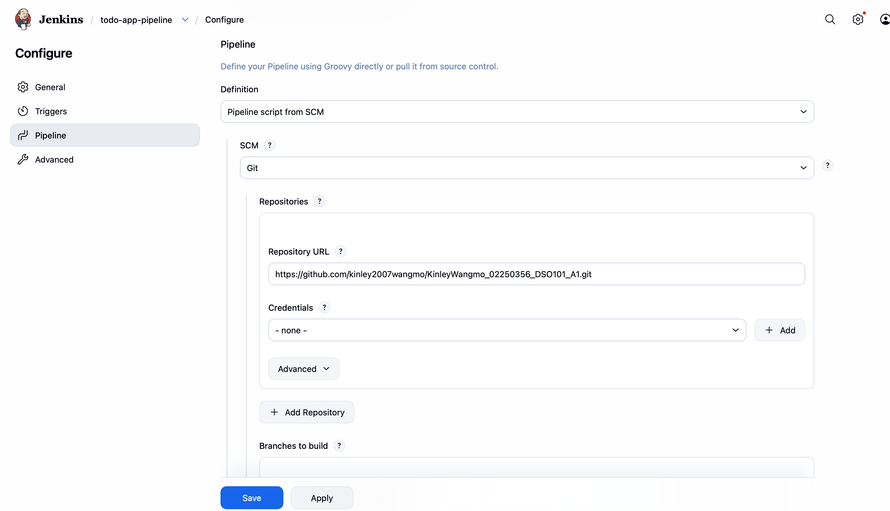
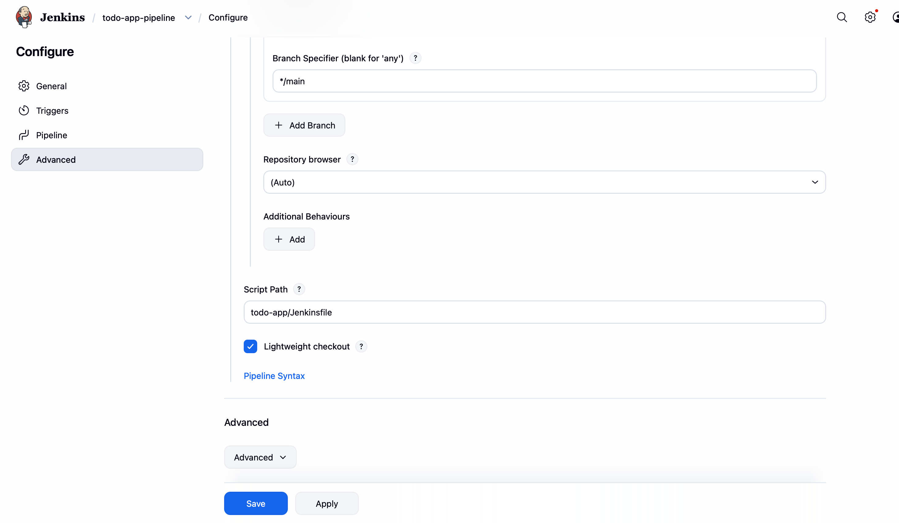

### 2. Console Output

All commands executed successfully.
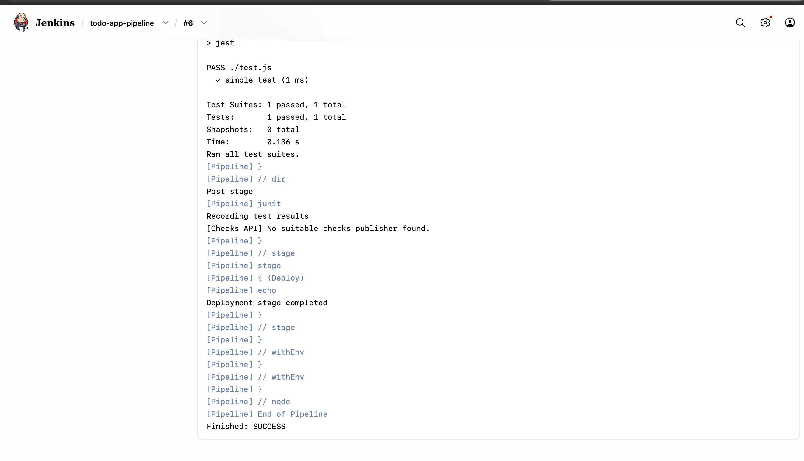

### 3. Jest Testing Configuration

Backend unit tests executed using Jest.
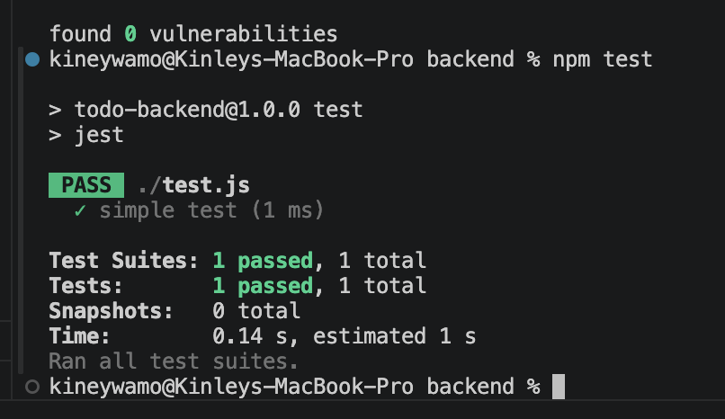

### 4. GitHub Repository Setup

The Assignment 1 project repository was reused for this assignment.

Repository Link:
https://github.com/kinley2007wangmo/KinleyWangmo_02250356_DSO101_A1

### 5. Jenkins Pipeline Configuration

A Jenkins pipeline was created using a Jenkinsfile.

Pipeline stages included:

- Check Node Version
- Checkout
- Install Backend Dependencies
- Install Frontend Dependencies
- Build Frontend
- Run Backend Tests
- Deploy
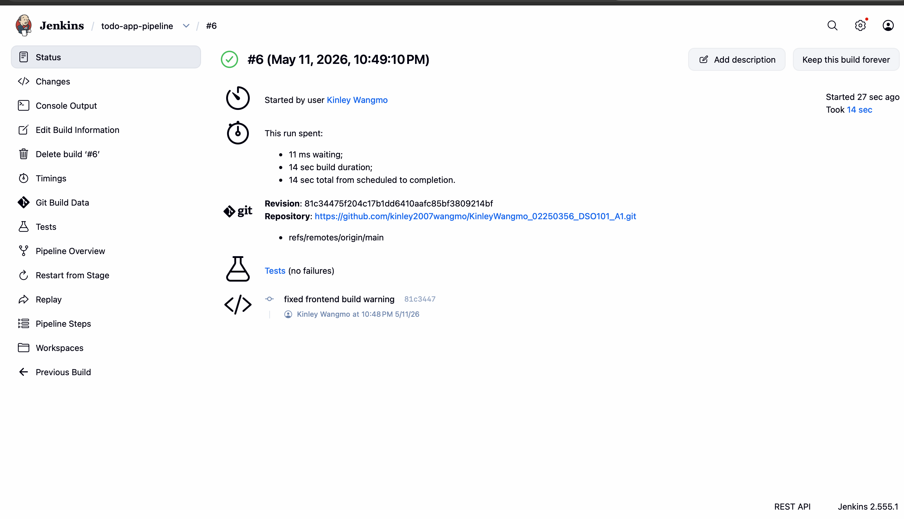

### 6. Build Process
Earlier build failed due to:
- npm not found
- frontend ESLint error

Fixed by:
- setting PATH in Jenkins
- using CI=false for React build
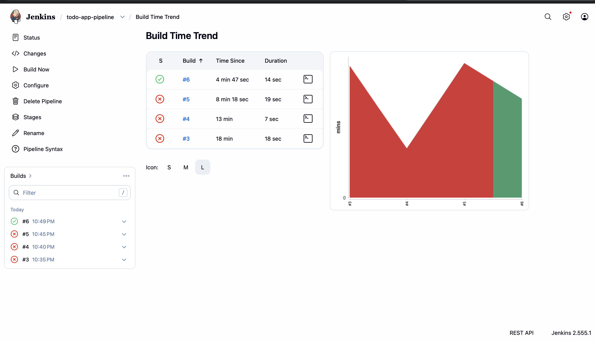

## Challenges Faced

- Jenkins could not detect npm initially.
- Folder paths inside Jenkinsfile were incorrect.
- React frontend build failed because CI treated warnings as errors.
- Some Jenkins plugins were unavailable.

These issues were fixed by:
- Configuring PATH manually in Jenkinsfile
- Correcting backend/frontend directory paths
- Using CI=false during frontend build

---

## Output

- Successful Jenkins pipeline execution
- Successful frontend build
- Successful backend test execution
- Test reports generated in Jenkins

# Conclusion

The Jenkins CI/CD pipeline was successfully configured to automate the installation, build, testing, and deployment stages for the To-Do application.

### GitHub Link
[https://github.com/kinley2007wangmo/KinleyWangmo_02250356_DSO101_A1.git]