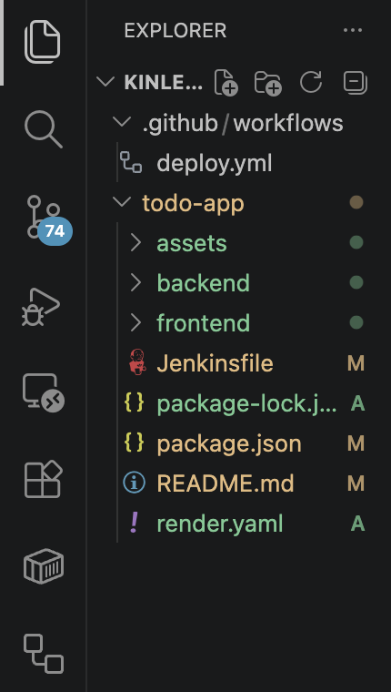
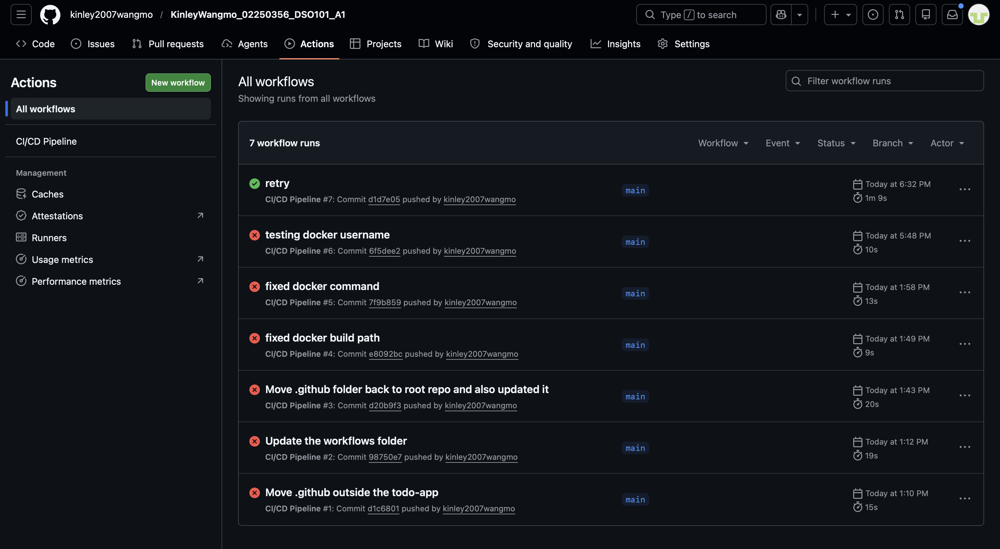
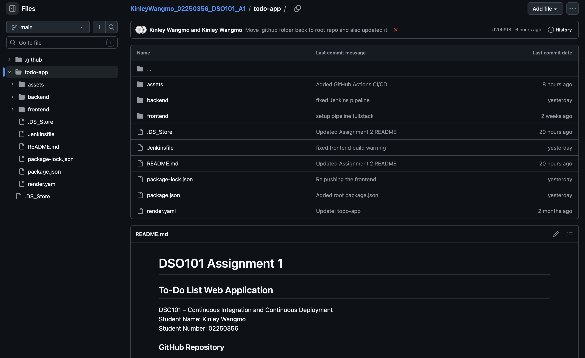
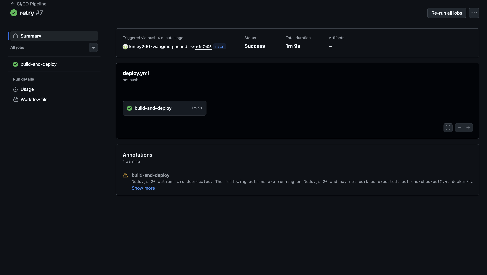
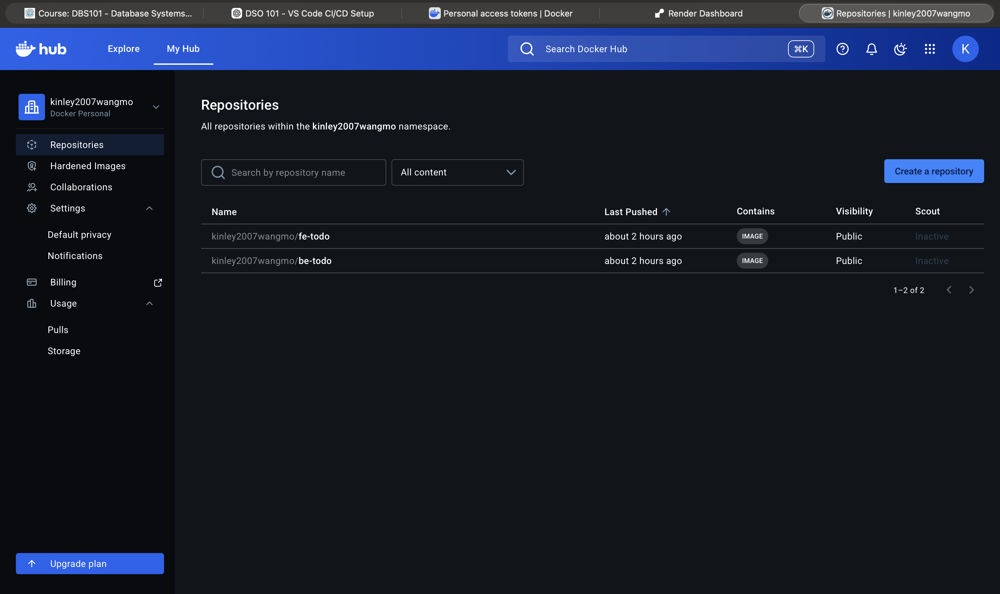
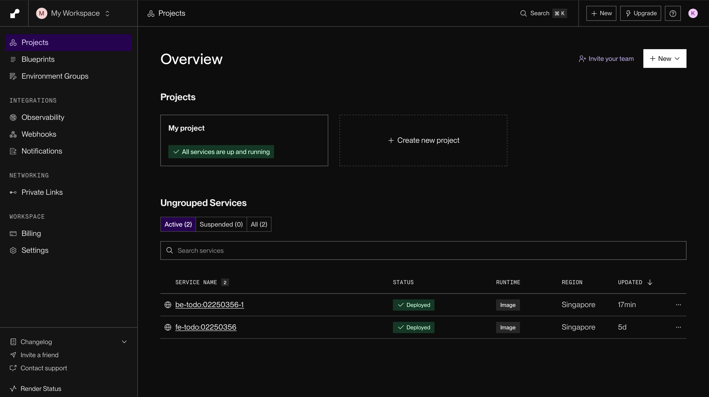
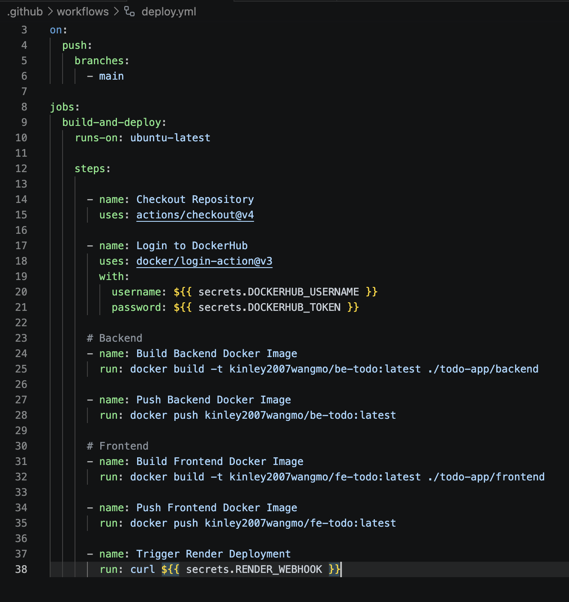
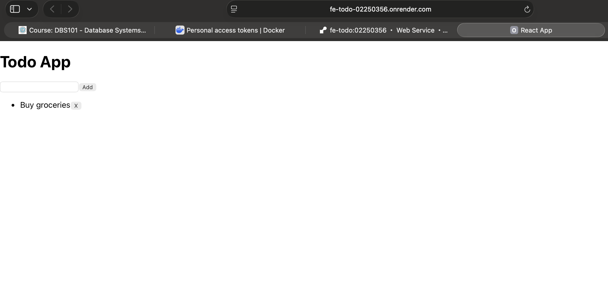

# DSO101 Assignment 3 
## CI/CD Pipeline

### Project Overview

This project demonstrates a complete CI/CD pipeline for a To-Do List application using GitHub Actions, DockerHub, and Render.com.

The project includes:
- Frontend service
- Backend service
- Docker containerization
- Automated CI/CD workflow
- Cloud deployment using Render

---

### Technologies Used

- GitHub
- GitHub Actions
- Docker
- DockerHub
- Render.com
- Node.js
- Jenkins

---

### Repository Structure

---

## Steps Performed

### 1. Docker Setup
- Created Dockerfiles for frontend and backend.
- Built Docker images locally.
- Pushed images to DockerHub.

### 2. Jenkins Pipeline
- Configured Jenkins pipeline using Jenkinsfile.
- Automated build and test process.

### 3. GitHub Actions CI/CD
- Created deploy.yml workflow.
- Configured GitHub Secrets.
- Automated Docker image build and push.
- Triggered automatic Render deployment.

### 4. Render Deployment
- Connected Docker images from DockerHub.
- Successfully deployed frontend and backend services.

---

## Challenges Faced

- Configuring GitHub Actions workflow paths.
- DockerHub authentication issues.
- Managing repository structure for workflow detection.

---

## Learning Outcomes

- Learned how CI/CD pipelines work.
- Learned Docker containerization.
- Learned GitHub Actions automation.
- Learned cloud deployment using Render.
- Learned Jenkins pipeline configuration.

---

## Screenshots

### GitHub Repository

### GitHub Actions Successful Workflow

### DockerHub Images

### Render Deployment

### deploy.yml in VS Code

### Live Application

---

## Live Deployment Link

Frontend:
https://fe-todo-02250356.onrender.com

Backend:
https://be-todo-02250356-1.onrender.com

### GitHub Link:
https://github.com/kinley2007wangmo/KinleyWangmo_02250356_DSO101_A1.git

Testing pipeline in A3